<!--
  GOD-TIER GITHUB PROFILE README
  Design: SaaS Dashboard / Glassmorphism
  Author: Trae AI for Kai
-->

<!-- HERO SECTION: ADVANCED ANIMATED HEADER -->

  

 

<!-- TYPING ANIMATION -->

  

<!-- SECTION 2: TECH STACK CONTROL PANEL -->

  

  
  
  
  
  
  
  

  

<!-- SECTION 3: LIVE ACTIVITY GRAPH -->

  

<!-- Snake Game Animation -->
<picture>
  <source media="(prefers-color-scheme: dark)" srcset="https://raw.githubusercontent.com/akai07/akai07/output/github-contribution-grid-snake-dark.svg">
  <source media="(prefers-color-scheme: light)" srcset="https://raw.githubusercontent.com/akai07/akai07/output/github-contribution-grid-snake.svg">
  
</picture>

 

<!-- 3D Isometric City -->

  

<!-- SECTION 4: KAI PHILOSOPHY -->

  <em>"AI turns complexity into clarity, and efficiency turns vision into momentum."</em>

 

  

