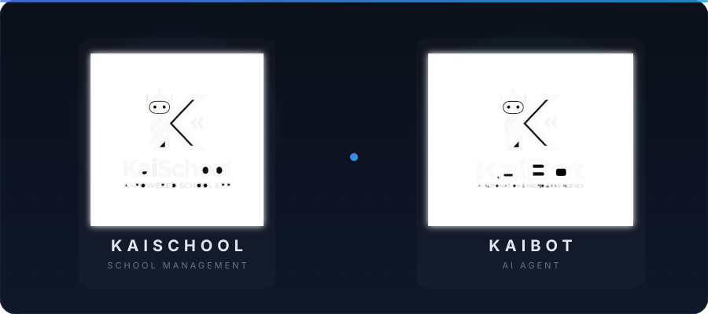

<!-- ============================================================ -->
<!-- HERO SECTION                                                   -->
<!-- ============================================================ -->

 

<!-- TYPING ANIMATION -->

  

<!-- ============================================================ -->
<!-- SOCIAL LINKS BAR                                                -->
<!-- ============================================================ -->

  
  &nbsp;
  
  &nbsp;
  
  &nbsp;
  
  &nbsp;
  

 

<!-- ============================================================ -->
<!-- STATS DASHBOARD                                                -->
<!-- ============================================================ -->

<table>
  <tr>
    <td width="50%" align="center">
       
      
    </td>
    <td width="50%" align="center">
       
      
    </td>
  </tr>
  <tr>
    <td width="50%" align="center">
       
      
    </td>
    <td width="50%" align="center">
       
      <!-- TryHackMe badge - updated daily via GitHub Action -->
      
    </td>
  </tr>
</table>

 

<!-- ============================================================ -->
<!-- STREAK STATS                                                    -->
<!-- ============================================================ -->

  

  

<!-- ============================================================ -->
<!-- TECH STACK                                                      -->
<!-- ============================================================ -->

  
  &nbsp;
  
  &nbsp;
  
  &nbsp;
  
  &nbsp;
  

  

  
  &nbsp;
  
  &nbsp;
  
  &nbsp;
  
  &nbsp;
  

  

  
  &nbsp;
  
  &nbsp;
  
  &nbsp;
  
  &nbsp;
  

  

<!-- ============================================================ -->
<!-- CONTRIBUTION ACTIVITY                                           -->
<!-- ============================================================ -->

  <picture>
    <source media="(prefers-color-scheme: dark)" srcset="https://raw.githubusercontent.com/akai07/akai07/output/github-contribution-grid-snake-dark.svg">
    <source media="(prefers-color-scheme: light)" srcset="https://raw.githubusercontent.com/akai07/akai07/output/github-contribution-grid-snake.svg">
    
  </picture>

    

  

  

<!-- ============================================================ -->
<!-- PHILOSOPHY QUOTE                                                 -->
<!-- ============================================================ -->

  <table align="center" border="0" cellpadding="0" cellspacing="0">
    <tr>
      <td align="center" style="border: 1px solid rgba(99, 102, 241, 0.2); border-radius: 16px; padding: 24px 40px; background: rgba(99, 102, 241, 0.04);">
        

          "AI turns complexity into clarity, and efficiency turns vision into momentum."
        

        

          — Apoorv Anand
        

      </td>
    </tr>
  </table>

  

<!-- ============================================================ -->
<!-- PROFILE VISITORS                                                -->
<!-- ============================================================ -->

  

    

  <!-- DYNAMIC LAST UPDATED -->
  <i>Last refreshed: automatically synced daily via GitHub Actions</i>

